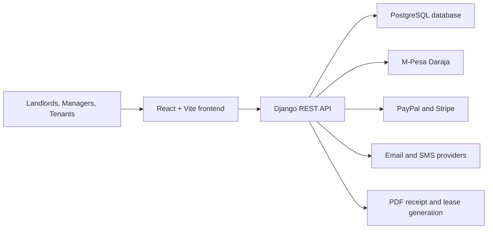

# KRIB Rental Management Platform
## Improved Implementation Plan

Version: 2.0  
Last updated: 2026-04-02  
Basis: Original implementation plan PDF plus the current repository structure, deployment files, and operational workflows.

## 1. Executive Summary

KRIB is already beyond the concept stage. The current repository contains a working Django and React application with invite-based onboarding, lease generation, payment processing paths, notifications, documents, wallet logic, and deployment configuration.

This improved implementation plan therefore focuses on rollout and operational execution, not just theoretical development phases. It explains how to set up the application, onboard data, validate the release, deploy safely, train users, and maintain the system after go-live.

## 2. Implementation Objectives

- Deploy KRIB in a stable, repeatable way
- Onboard landlords, managers, tenants, properties, units, and leases with minimal friction
- Enable secure authentication and role-based access
- Support rent collection, maintenance management, and document sharing from day one
- Keep the system maintainable through testing, monitoring, and controlled change management

## 3. Current Solution Baseline

| Area | Current implementation |
| --- | --- |
| Frontend | React 18 with React Router and Vite |
| Backend | Django 6, DRF, SimpleJWT |
| Database | PostgreSQL in hosted setups, SQLite fallback for local development |
| Payments | M-Pesa STK flow live in tenant UI, backend endpoints for PayPal and Stripe |
| Notifications | In-app notices, email support, SMS integration path |
| Documents | Lease, identity, receipt, and other scoped documents |
| Deployment | Render backend definition, Vercel-compatible frontend routing, Docker Compose dev and prod-like files |

## 4. Architecture Overview



## 5. Recommended Rollout Approach

The recommended delivery sequence is:

1. Prepare the environment and secrets.
2. Run the application locally and confirm the core workflow.
3. Deploy a hosted backend and frontend preview.
4. Onboard pilot landlords, managers, and tenants.
5. Validate payment, notification, and document flows.
6. Complete user training and handover.
7. Go live with a short hypercare period.

## 6. Environment Setup Plan

### 6.1 Prerequisites

- Python 3.11 or later
- Node.js 18 or later
- npm
- PostgreSQL for hosted environments
- Access to M-Pesa, SMTP, and optional SMS credentials where required

### 6.2 Backend Setup

```powershell
python -m venv .venv
.venv\Scripts\Activate.ps1
pip install -r backend\requirements.txt
cd backend
python manage.py migrate
python manage.py seed_krib
python manage.py runserver 0.0.0.0:8000
```

### 6.3 Frontend Setup

```powershell
cd frontend
npm install
npm run dev
```

### 6.4 Environment Variables

Use `.env.example` as the authoritative baseline. The most important variable groups are:

- Django security and host settings
- Database connection settings
- Frontend API base URL
- M-Pesa credentials and callback URL
- PayPal and Stripe credentials if enabled
- SMTP email settings
- SMS provider settings
- Business metadata for user-facing communication

## 7. Deployment Plan

### 7.1 Recommended Hosted Topology

Recommended default:

- Backend on Render using `render.yaml`
- Frontend on a static host with SPA rewrite support such as Vercel

Why this is the recommended first deployment:

- The backend already includes a Render service definition
- The frontend already includes a rewrite rule for client-side routing
- This split keeps deployment simple and fast for early production rollout

### 7.2 Alternate Single-Origin Topology

For teams that want one origin for frontend and backend, use the included production-style Docker Compose and Nginx setup. This option is suitable when deploying on a VPS or cloud VM.

### 7.3 Hosted Deployment Steps

#### Backend

1. Provision the PostgreSQL database.
2. Create the backend service from the repository.
3. Set all required environment variables.
4. Run automatic build and start commands from `render.yaml`.
5. Confirm that `/api/health/` returns a healthy response.

#### Frontend

1. Deploy the `frontend` application to a static host.
2. Set `VITE_API_URL` to the live backend origin if frontend and backend are separated.
3. Confirm that SPA routing rewrites all unmatched paths to `index.html`.
4. Build and verify the role-based screens.

### 7.4 Production Readiness Checklist

- `DJANGO_DEBUG=0`
- Strong `DJANGO_SECRET_KEY`
- Explicit allowed hosts and trusted origins
- Managed PostgreSQL configured
- Public HTTPS callback URL for M-Pesa
- SMTP configured for password reset and invite email
- SMS credentials configured if SMS delivery is required
- Static assets collected successfully
- Health endpoint monitored

## 8. Data Conversion and Onboarding Plan

KRIB replaces manual paper, spreadsheet, or ad hoc messaging workflows. Data onboarding should follow this order:

1. Create the landlord account and business profile.
2. Add all target properties.
3. Add units and verify rent and deposit values.
4. Invite managers where delegation is needed.
5. Invite tenants before occupancy.
6. Create leases for occupied units.
7. Capture tenant ID or passport images during lease creation.
8. Capture tenant signature and generate the lease agreement.
9. Upload any additional shared property documents.

### 8.1 Migration Notes

- Historical payment records can be entered if a baseline is needed.
- Active occupied units should be prioritized before vacant inventory.
- Identity and lease documents should be reviewed immediately after upload.

## 9. Operational Workstreams

| Workstream | Owner | Output |
| --- | --- | --- |
| Environment setup | Developer or DevOps owner | Running backend, frontend, and database |
| Data onboarding | Landlord plus implementation support | Properties, units, users, leases entered |
| Payment configuration | Developer or operations owner | M-Pesa callback and sandbox validation |
| Messaging configuration | Developer or operations owner | Working email and optional SMS notifications |
| Acceptance testing | Developer plus pilot users | Signed-off pilot flow |
| Training and handover | Project owner | User readiness and support materials |

## 10. Suggested Rollout Schedule

| Phase | Duration | Key deliverable |
| --- | --- | --- |
| Environment preparation | 1 day | Local and hosted environments configured |
| Pilot data onboarding | 1 to 2 days | First landlord, properties, units, and users loaded |
| Workflow validation | 1 day | Lease, payment, maintenance, and document flows verified |
| User acceptance testing | 1 day | Pilot users confirm readiness |
| Bug fixing and release check | 1 day | Critical issues resolved and release checks pass |
| Go-live and hypercare | 2 to 3 days | Live system monitored closely after launch |

## 11. Validation Before Go-Live

Run the following before deployment approval:

```powershell
cd backend
python manage.py test
```

```powershell
./scripts/release_check.ps1
```

Manual validation should then confirm:

- Landlord can create property, unit, invite, and lease
- Manager can operate only within assigned property scope
- Tenant can pay rent and submit maintenance tickets
- Documents are visible only to the correct user
- Notifications can be delivered to the intended audience

## 12. Training Plan

### 12.1 Training Objectives

Users should be able to:

- Sign in and understand their dashboard
- Complete the tasks relevant to their role
- Recognize common errors and know what to do next
- Access documents and notices confidently

### 12.2 Training Method

- Share the improved user manual
- Run a guided demo using pilot data
- Walk through the landlord, manager, and tenant journeys
- Confirm understanding by having users complete a short hands-on exercise

## 13. Support and Maintenance Plan

### 13.1 Corrective Maintenance

Use the existing automated tests and release checks to triage and fix production defects quickly. Payment, authentication, and access-control defects should be treated as highest priority.

### 13.2 Adaptive Maintenance

Update the system when:

- M-Pesa API requirements change
- Browser compatibility requirements change
- Hosting platform constraints change
- Payment or messaging providers update credentials or endpoints

### 13.3 Perfective Maintenance

Possible enhancements after go-live include:

- Deeper analytics
- More self-service payment options in the tenant UI
- Expanded reporting and export workflows
- Better admin operations for larger portfolios

## 14. Change Management

All changes should follow this flow:

1. Record the requested change.
2. Assess risk to money flow, access control, or data integrity.
3. Implement the change in a branch.
4. Run automated tests and release checks.
5. Validate manually if the change touches user journeys.
6. Deploy only after approval.

Git should remain the source of truth for code history, and production changes should never bypass test validation.

## 15. Key Risks and Mitigations

| Risk | Likely impact | Mitigation |
| --- | --- | --- |
| Missing payment credentials | Rent collection unavailable | Verify payment env vars before go-live |
| Wrong callback URL | Payments remain pending | Use a public HTTPS callback and test with sandbox |
| Weak scoping controls after new features | Data exposure across properties | Keep permission tests mandatory |
| Poor onboarding data quality | Incorrect rent, lease, or tenant records | Validate properties, units, and tenant data during onboarding |
| Email or SMS misconfiguration | Password reset or notices fail | Test each delivery path in preview before production |

## 16. Success Criteria

The implementation should be considered successful when:

- The hosted application is reachable and healthy
- Core landlord, manager, and tenant workflows are complete
- Payments and documents behave correctly
- Pilot users can operate without developer assistance for basic tasks
- Release checks pass and no critical defects remain

## 17. Summary

KRIB is ready for a structured rollout rather than a purely theoretical implementation exercise. The repository already contains the foundation required for deployment, onboarding, training, and support. The practical next step is to execute this plan with a pilot group, validate the operational flows, and then move into production with controlled monitoring and fast feedback.
